<table>
  <th>Name</th>
  <th>Price</th>
  <th>Available</th>
  <th>Description</th>
  <th>Image</th>
  
  <tr>
    <td>Chromecast</td>
    <td>Free</td>
    <td>❌</td>
    <th>N/A</th>
    <td>
      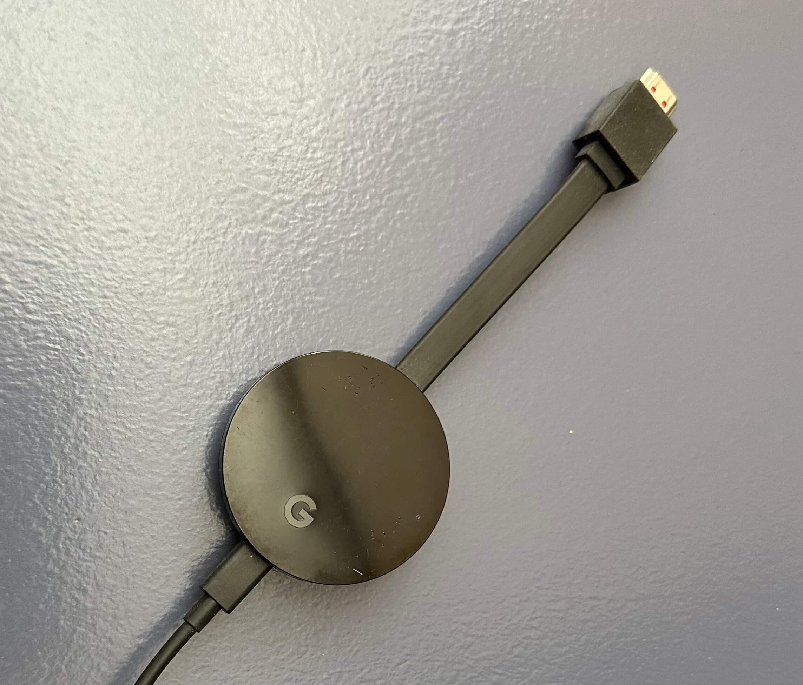
    </td>
  </tr>

  <tr>
    <td>Google Home</td>
    <td>Free</td>
    <td>✅</td>
    <th>OG, gen 1</th>
    <td>
      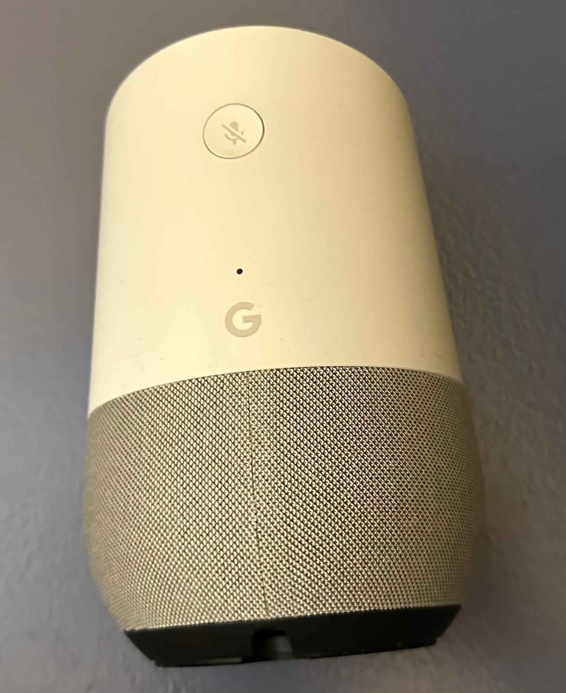
    </td>
  </tr>

  <tr>
    <td>Google Nest Hub</td>
    <td>Free</td>
    <td>❌</td>
    <th>OG, gen 1</th>
    <td>
      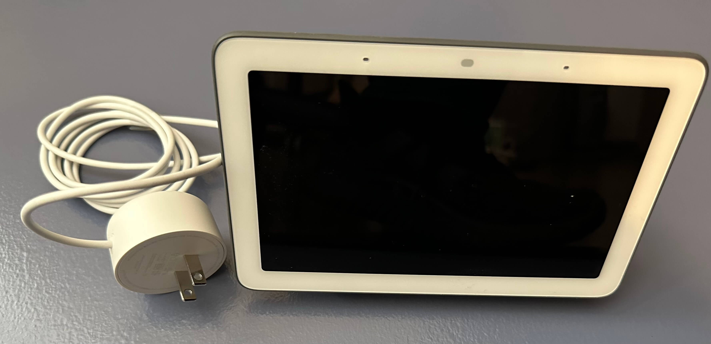
    </td>
  </tr>

  <tr>
    <td>Home mini</td>
    <td>Free</td>
    <td>❌</td>
    <th>Some old gen, new in box</th>
    <td>
      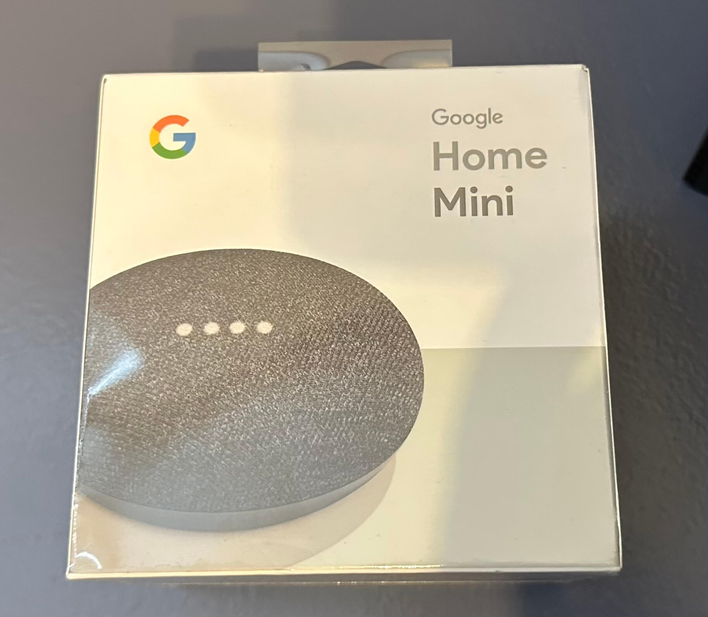
    </td>
  </tr>

  <tr>
    <td>Home mini</td>
    <td>Free</td>
    <td>❌</td>
    <th>Some old gen</th>
    <td>
      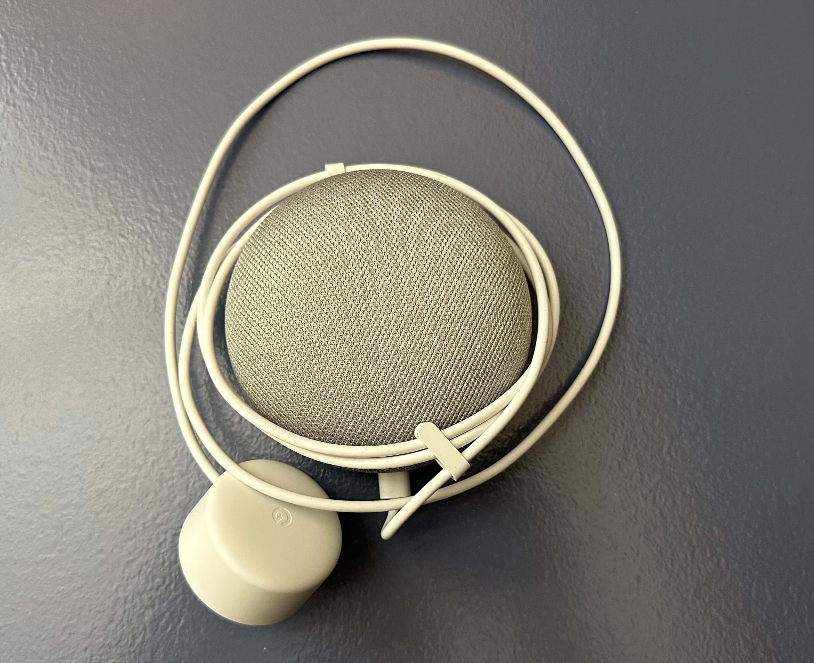
    </td>
  </tr>

  <tr>
    <td>Old Magic Keyboard + Trackpad</td>
    <td>Free</td>
    <td>✅</td>
    <th>Really old gen, uses AA batteries</th>
    <td>
      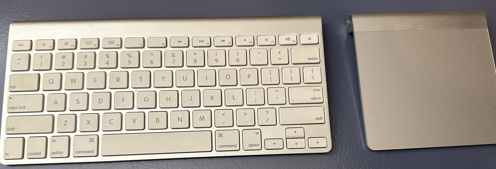
    </td>
  </tr>

  <tr>
    <td>beyerdynamic DT 770 PRO</td>
    <td>Free</td>
    <td>✅</td>
    <th>Really rough conditions</th>
    <td>
      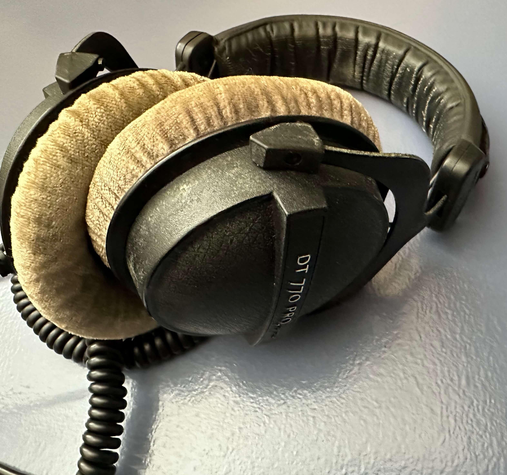
    </td>
  </tr>

  <tr>
    <td>Sennheiser HD 650</td>
    <td>$50</td>
    <td>❌</td>
    <th>N/A</th>
    <td>
      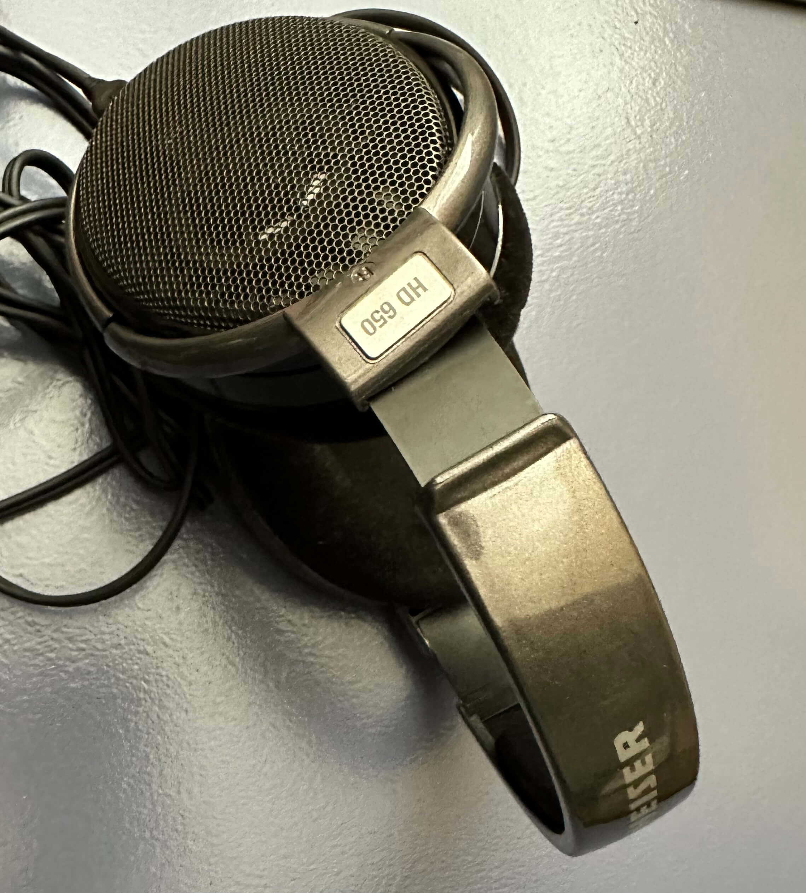
    </td>
  </tr>

  <tr>
    <td>Bose QuiteComfort 25</td>
    <td>Free</td>
    <td>✅</td>
    <th>Old gen, uses AAA batteries</th>
    <td>
      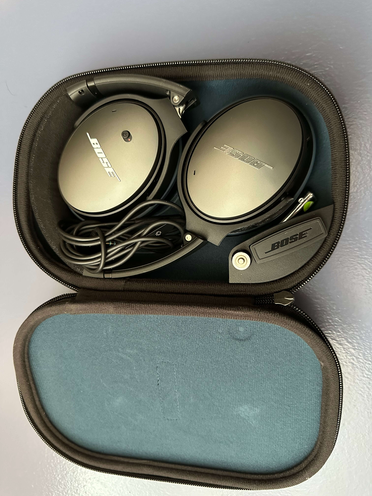
    </td>
  </tr>

  <tr>
    <td>Objective2 DAC+Amp</td>
    <td>Free</td>
    <td>❌</td>
    <th>My name is engraved :( https://jdslabs.com/product/objective2/</th>
    <td>
      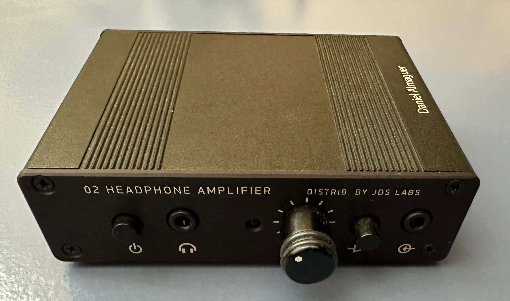
    </td>
  </tr>

  <tr>
    <td>Random Qotom box</td>
    <td>Free</td>
    <td>❌</td>
    <th>Can't really remember the specs, ran pfSense fine for a few years.</th>
    <td>
      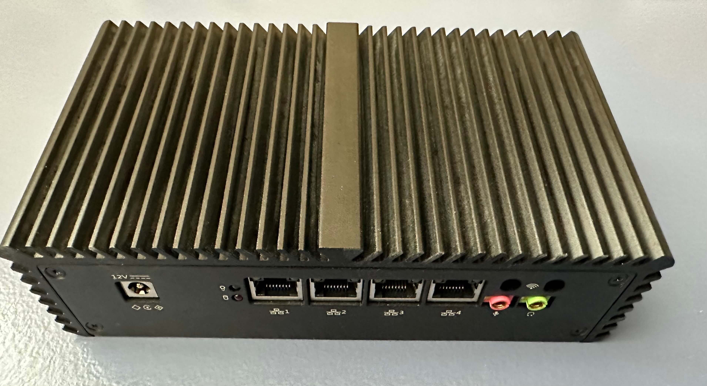
    </td>
  </tr>

  <tr>
    <td>Netgear Orbi</td>
    <td>Free</td>
    <td>❌</td>
    <th>First gen? Wireless or cable backhaul</th>
    <td>
      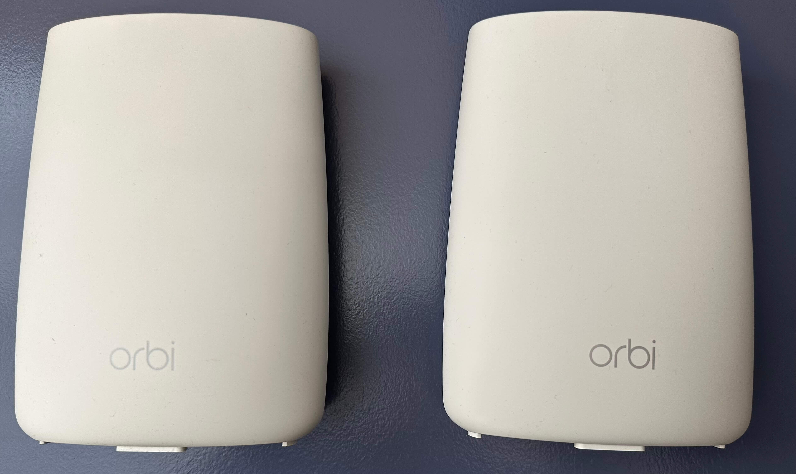
    </td>
  </tr>

  <tr>
    <td>Tp-Link 16-port switch</td>
    <td>Free</td>
    <td>✅</td>
    <th>TL-SG116E</th>
    <td>
      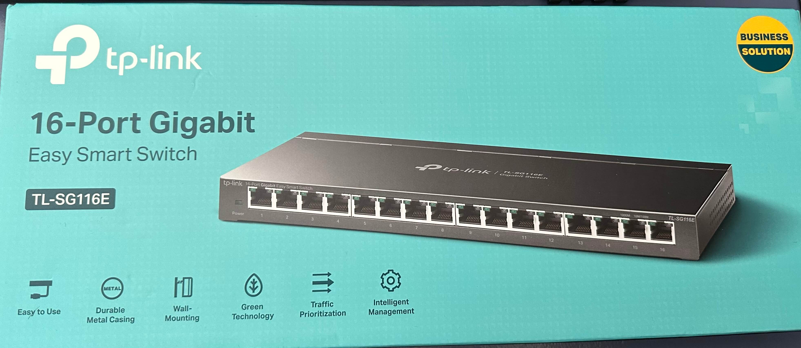
    </td>
  </tr>

  <tr>
    <td>Tp-Link 24-port JetStream switch</td>
    <td>Free</td>
    <td>✅</td>
    <th>T1700G-28TQ</th>
    <td>
      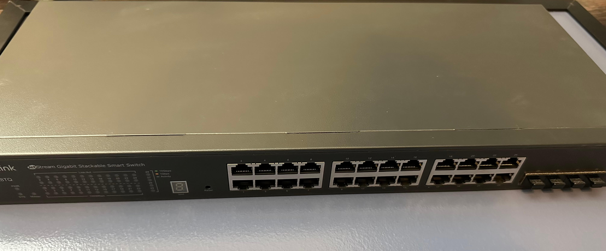
    </td>
  </tr>

</table>

# Free Rubiks cube included on any item :)
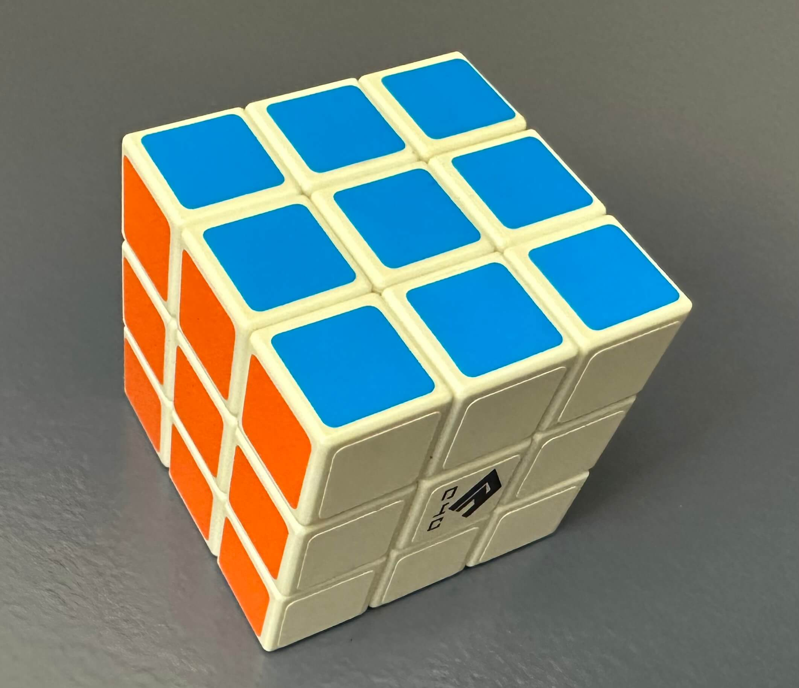
